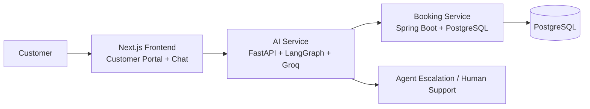

# Prime Airlines Agentic AI

A full-stack airline support experience that combines a customer-facing frontend, an AI-powered travel assistant, and a booking backend with persistent airline records.

## Project description

Prime Airlines Agentic AI is a demo airline service that lets customers interact through a conversational chat experience to:

- book a flight
- cancel an existing booking
- request a refund
- escalate to a human agent when needed

The system demonstrates how an agentic workflow can orchestrate both customer support and backend booking operations in a realistic airline context.

## Why this project matters

This project brings together modern AI workflows and traditional service architecture:

- Next.js customer interface for real-time interaction
- FastAPI + LangGraph orchestration for conversational logic
- Spring Boot booking service with PostgreSQL persistence
- AI assistant flow designed for airline scenarios and demo-friendly support

## Architecture



## Key features

- conversational booking flow
- one-question-at-a-time prompting for a smoother demo experience
- no payment collection in the simplified customer demo flow
- generated booking references and record persistence
- booking lookup and cancellation support
- escalation to a live agent workflow

## Tech stack

- Frontend: Next.js, React, TypeScript
- AI service: FastAPI, LangGraph, LangChain, Groq
- Backend: Java, Spring Boot, JPA
- Database: PostgreSQL
- Infrastructure: Docker Compose, Redis

## Repository layout

```text
airline-agentic-ai/
├── ai-service/           # AI agent logic and FastAPI app
├── booking-service/      # Spring Boot booking API
├── frontend/             # Next.js customer portal and chat UI
├── infra/                # Docker Compose infrastructure
├── .gitignore
├── README.md
└── ...
```

## Quick start

### 1. Start infrastructure

```bash
cd infra
docker compose up -d
```

### 2. Start the booking backend

```bash
cd booking-service/booking-service
./mvnw spring-boot:run
```

### 3. Start the AI service

```bash
cd ai-service
python -m venv .venv
# Windows PowerShell
.\.venv\Scripts\Activate.ps1
pip install -r requirements.txt
```

Create a local `.env` file from `.env.example` and add your Groq API key:

```bash
copy .env.example .env
```

Then run:

```bash
python main.py
```

### 4. Start the frontend

```bash
cd frontend
npm install
npm run dev
```

Open http://localhost:3000

## GitHub landing section snippet

```md
## Prime Airlines Agentic AI

AI-powered airline support for booking, cancellations, refunds, and agent escalation.

Built with Next.js, FastAPI, LangGraph, and Spring Boot to demonstrate a realistic airline customer support workflow with persistent booking data.
```

## Notes

- Keep secrets in a local `.env` file and do not commit them.
- This is a demo airline workflow designed to be realistic but lightweight.
- PostgreSQL is used for persistent booking records in the backend service.

## License

This project is for demo and learning purposes unless otherwise specified.
